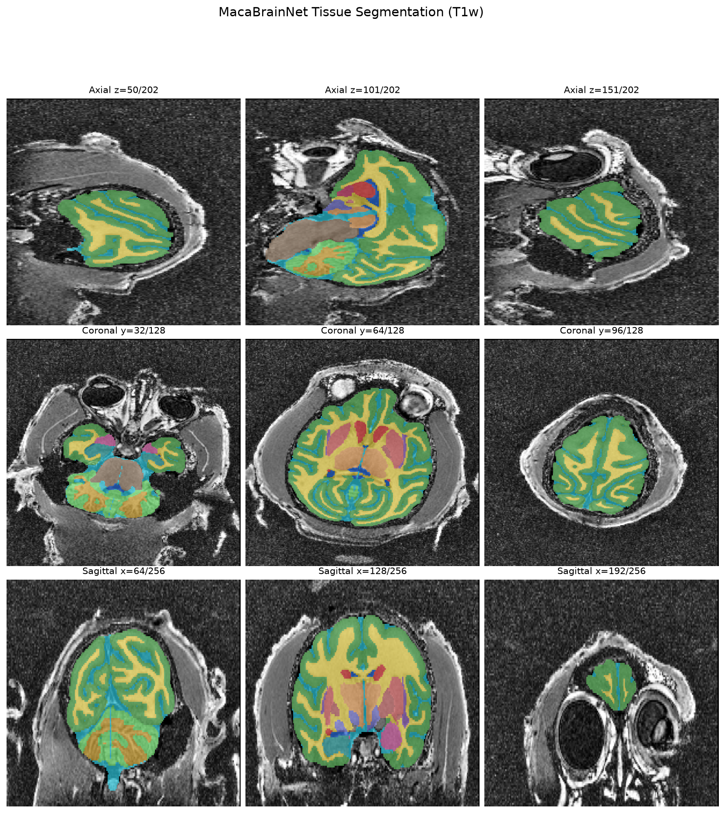
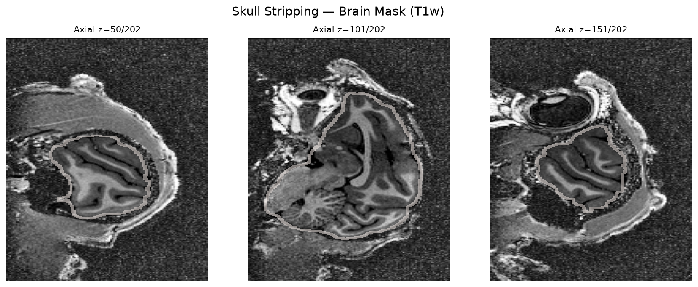
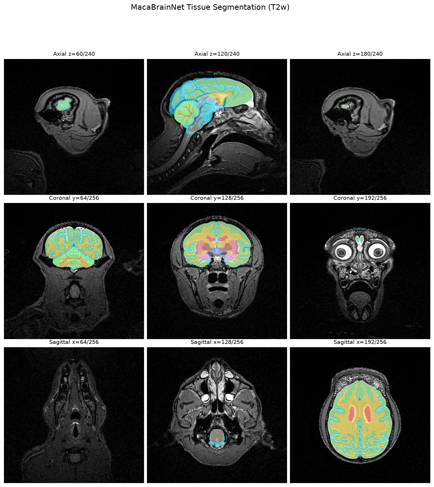
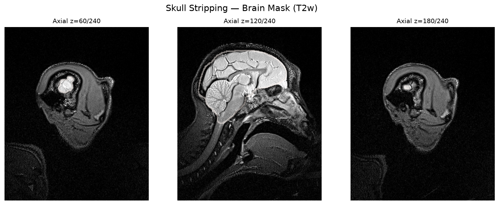
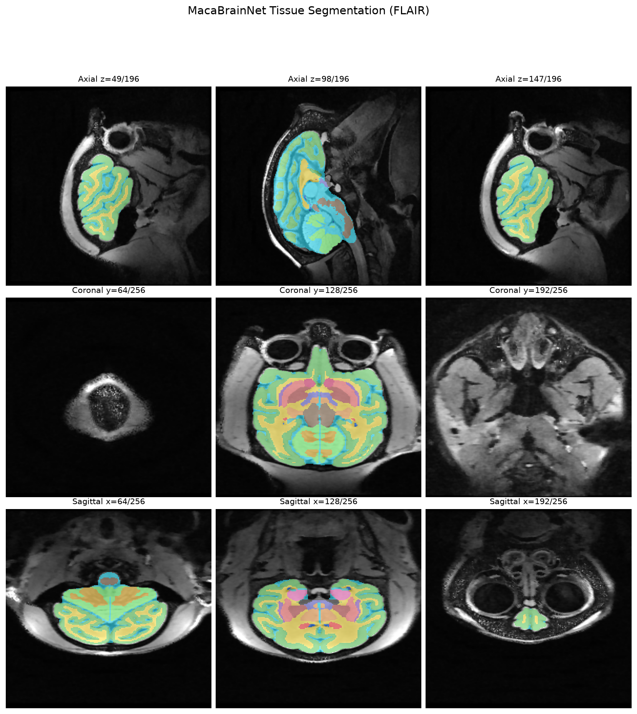
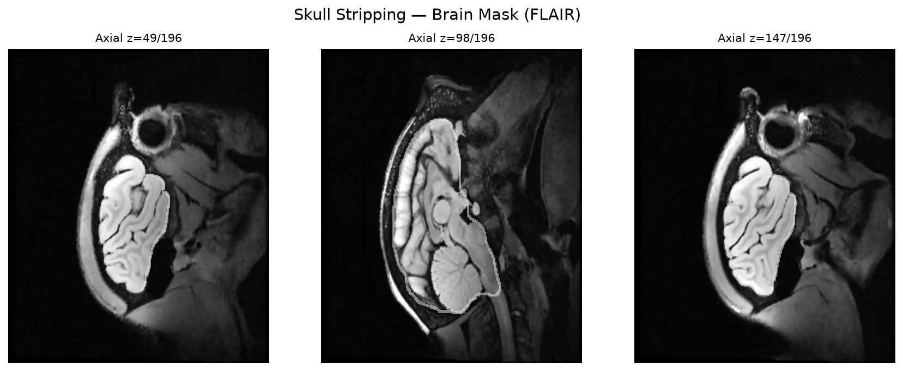
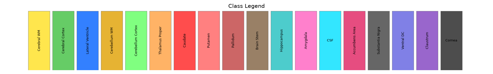

# MacaBrainNet v2

Monkey brain MRI segmentation via a unified multi-class tissue segmentation strategy.

Accurate isolation and classification of brain tissues are critical for cortical surface reconstruction. MacaBrainNet employs a unified multi-class tissue segmentation approach in which brain extraction is implicitly defined by the union of predicted anatomical labels. The model jointly segments cortical gray matter, white matter, cerebrospinal fluid, cerebellum, brainstem, and multiple subcortical structures, generating both a high-fidelity brain mask and anatomically informative labels for downstream analyses.

## Training Data & Strategy

To address the scarcity of annotated macaque MRI data, tissue segmentation labels were developed using an **iterative, pipeline-preserving bootstrapping strategy**. The downstream reconstruction workflow (bias-field correction, volumetric registration, surface initialization, and surface refinement) was kept fixed while only the segmentation component was iteratively improved. Initial labels were obtained by combining deep learning-based cortical tissue segmentation with atlas-informed subcortical labeling after volumetric registration. Cases with suboptimal masks or tissue labels were manually corrected and reprocessed, yielding a curated set of anatomically consistent, surface-informed labels for model training.

Using this strategy, we assembled a **training set of 2,157 macaque MRI scans from 39 acquisition centers**.

## Architecture

The segmentation model is based on **SwinUNETR-B**, a hybrid architecture combining Swin Transformer encoders with CNN decoders, initialized with self-supervised pretraining and fine-tuned for 18-class tissue segmentation (19 including background). Inference uses sliding-window softmax averaging across 5-fold cross-validation ensembles for robust prediction.

| Component | Detail |
|---|---|
| Architecture | SwinUNETR v2, `feature_size=48`, `patch_size=(2,2,2)` |
| Encoder | 4 stages: depths=[2,2,2,2], heads=[3,6,12,24] |
| Decoder | Deep supervision: 5 output heads |
| Pretraining | LocalGlobal self-supervised (17,000 steps) |
| Skull stripping | DiceFocalLoss, 0.5 mm isotropic, patch 96³ |
| Tissue segmentation | Weighted DiceFocalLoss, 0.4 mm isotropic, patch 96³, 19 classes |
| Ensemble | Softmax averaging across 5-fold cross-validation |
| Training data | 2,157 macaque MRI scans from 39 centers |

## Example Results

MacaBrainNet supports multi-modal inputs (T1w, T2w, FLAIR) with a unified model.

### T1w




### T2w




### FLAIR




### Label Legend



## Requirements

- Python 3.10+
- CUDA-capable GPU (recommended, CPU inference supported but slow)
- PyTorch 2.x
- MONAI (for SwinUNETR blocks only)
- nibabel, numpy, scipy

## Installation

```bash
# Clone the repository
git clone https://github.com/yahuiwei123/MacaBrainNet.git
cd macaBrainNet_v2

# Install dependencies
pip install torch monai nibabel scipy tqdm tensorboard

# Download pretrained model checkpoints from HuggingFace Hub
python download_from_hf.py
```

Model checkpoints will be saved to `swinunetr_models/` with this structure:

```
swinunetr_models/
├── skull_stripping/
│   ├── fold_1/best_3d_swinunetr_model.pth
│   ├── fold_2/best_3d_swinunetr_model.pth
│   ├── fold_3/best_3d_swinunetr_model.pth
│   ├── fold_4/best_3d_swinunetr_model.pth
│   └── fold_5/best_3d_swinunetr_model.pth
└── tissue_segmentation/
    ├── fold_1/best_3d_swinunetr_model.pth
    ├── fold_2/best_3d_swinunetr_model.pth
    ├── fold_3/best_3d_swinunetr_model.pth
    ├── fold_4/best_3d_swinunetr_model.pth
    └── fold_5/best_3d_swinunetr_model.pth
```

## Quick Start

```bash
# Run the full pipeline on example data
bash src/run_example.sh
```

This runs skull stripping + tissue segmentation on the included example T1w image.
Results are saved to `example_output/`.

## Pipeline Usage

The full pipeline runs four steps automatically:

```
Input T1w.nii.gz
    │
    ▼
Step 1: Skull Stripping (ensemble, 5-fold)
    ├── Model: SwinUNETR, 0.5mm, binary
    └── Output: *_brain_mask.nii.gz
    │
    ▼
Step 2: Brain BBox Crop + Brain Mask
    ├── Finds brain bounding box from mask
    ├── Expands by 16 voxels outward
    ├── Crops original image to bbox region
    ├── Applies brain mask (non-brain → min intensity)
    └── Output: *_cropped.nii.gz
    │
    ▼
Step 3: Tissue Segmentation (ensemble, 5-fold)
    ├── Model: SwinUNETR, 0.4mm, 19-class
    └── Output: *_tissue_seg_cropped.nii.gz (cropped space)
    │
    ▼
Step 4: Remap to Original Space
    ├── Places segmentation back into full image volume
    └── Output: *_tissue_seg.nii.gz (original space)
```

### Run from command line

```bash
python pipeline.py \
    --img /path/to/T1w.nii.gz \
    --out-dir ./output \
    --padding 16 \
    --device cuda
```

### Run from Python

```python
from pipeline import run_pipeline

run_pipeline(
    img_path="T1w.nii.gz",
    out_dir="./output",
    padding=16,
    device="cuda",
)
```

### CLI arguments

| Argument | Default | Description |
|---|---|---|
| `--img` | (required) | Input T1w NIfTI image |
| `--out-dir` | (required) | Output directory |
| `--skull-ckpt-dir` | `swinunetr_models/skull_stripping` | Skull stripping checkpoints |
| `--tissue-ckpt-dir` | `swinunetr_models/tissue_segmentation` | Tissue seg checkpoints |
| `--skull-spacing` | 0.5 0.5 0.5 | Target spacing for skull strip (mm) |
| `--tissue-spacing` | 0.4 0.4 0.4 | Target spacing for tissue seg (mm) |
| `--patch-size` | 96 96 96 | Sliding window patch size |
| `--overlap` | 0.60 | Sliding window overlap ratio |
| `--padding` | 16 | Voxels to pad outward from brain bbox |
| `--device` | cuda | Device for inference |

## Single Model Inference

If you only need one task, you can use the individual prediction scripts:

```bash
# Skull stripping only (single checkpoint)
python predict.py \
    --img T1w.nii.gz \
    --out brain_mask.nii.gz \
    --ckpt swinunetr_models/skull_stripping/fold_1/best_3d_swinunetr_model.pth \
    --num-classes 2 \
    --spacing 0.5 0.5 0.5

# Skull stripping (ensemble, 5-fold averaging)
python predict_ensemble.py \
    --img T1w.nii.gz \
    --out brain_mask.nii.gz \
    --ckpt-dir swinunetr_models/skull_stripping \
    --num-classes 2 \
    --spacing 0.5 0.5 0.5

# Tissue segmentation (ensemble, 5-fold averaging)
python predict_ensemble.py \
    --img T1w_cropped.nii.gz \
    --out tissue_seg.nii.gz \
    --ckpt-dir swinunetr_models/tissue_segmentation \
    --num-classes 19 \
    --spacing 0.4 0.4 0.4
```

## Tissue Labels

The model outputs 19 contiguous classes (0 = background, 1–18 = tissue labels). Labels are derived from FreeSurfer-style anatomical IDs after hemisphere collapsing (left/right merged) and remapped to contiguous 0..18.

### Model Output → FreeSurfer ID Mapping

| Model ID | FS ID | Structure |
|---|---|---|
| 0 | — | Background |
| 1 | 2 | Cerebral White Matter (Left) |
| 2 | 3 | Cerebral Cortex (Left) |
| 3 | 4 | Lateral Ventricle (Left) |
| 4 | 7 | Cerebellum White Matter (Left) |
| 5 | 8 | Cerebellum Cortex (Left) |
| 6 | 10 | Thalamus Proper (Left) |
| 7 | 11 | Caudate (Left) |
| 8 | 12 | Putamen (Left) |
| 9 | 13 | Pallidum (Left) |
| 10 | 16 | Brain Stem |
| 11 | 17 | Hippocampus (Left) |
| 12 | 18 | Amygdala (Left) |
| 13 | 24 | CSF |
| 14 | 26 | Accumbens Area (Left) |
| 15 | 27 | Substantia Nigra (Left) |
| 16 | 28 | Ventral Diencephalon (Left) |
| 17 | 138 | Claustrum (Left) |
| 18 | 140 | Cornea |

> **Hemisphere collapse**: Right-hemisphere labels (41→2, 42→3, 43→4, 46→7, 47→8, 49→10, 50→11, 51→12, 52→13, 53→17, 54→18, 58→26, 59→27, 60→28, 139→138) are merged into their left-hemisphere equivalents before contiguous remapping. Midline structures (Brain Stem, CSF, Cornea) need no collapse.

## Training

To train your own models from scratch:

```bash
# Skull stripping (5-fold CV, 0.5mm, binary)
FOLD=1 bash train_skullstrip.sh

# Tissue segmentation (5-fold CV, 0.4mm, 19-class)
FOLD=1 bash train_tissueseg.sh
```

Training uses PyTorch DDP (default 4 GPUs). Configure via environment variables:

```bash
CUDA_VISIBLE_DEVICES=0,1,2,3  \
DATA_ROOT=/path/to/data         \
FOLD=1                           \
bash train_skullstrip.sh
```

## Project Structure

```
macaBrainNet_v2/
├── nets/swinunetr.py          # SwinUNETR architecture
├── data/
│   ├── dataset.py             # NiftiPatchDataset + dataloaders
│   ├── transforms.py          # I/O, preprocessing, augmentations
│   └── utils.py               # Label encoding utilities
├── losses/dice_focal_loss.py  # DiceLoss, FocalLoss, DiceFocalLoss
├── trainer.py                 # DDP trainer + sliding_window_inference
├── train_skullstrip.py        # Skull stripping training
├── train_skullstrip.sh        # Training launcher
├── train_tissueseg.py         # Tissue segmentation training
├── train_tissueseg.sh         # Training launcher
├── predict.py                 # Single-checkpoint inference
├── predict_ensemble.py        # Ensemble inference (5-fold)
├── pipeline.py                # End-to-end pipeline
├── download_from_hf.py        # Download models from HuggingFace
├── src/
│   ├── example/               # Example MRI data (T1w, T2w, FLAIR)
│   ├── run_example.sh         # Example pipeline run
│   ├── make_overlay.py        # Generate overlay visualizations
│   ├── tissue_overlay_*.png   # Example: tissue seg overlays
│   ├── brain_mask_overlay_*.png  # Example: brain mask overlays
│   └── tissue_legend.png      # Tissue class color legend
└── README.md
```

Model checkpoints are stored on HuggingFace Hub (yhwei/MacaBrainNet) and downloaded via `download_from_hf.py`.
